# ✈️ Travel Booking Platform

A web-based travel booking platform that allows users to search and book hotels and flights easily.

The system provides a simple travel planning experience where users can browse hotels, check flight schedules, make bookings, and manage their travel history.

This project was developed by **2 developers** and is included in my **developer portfolio**.

# 🚀 Features

### Customer Features
- **Hotel Search & Booking** – Users can search for hotels, view hotel details, choose room types, and make bookings.
- **Flight Search & Booking** – Users can search for flights based on route and schedule and book flight tickets.
- **Favorite Hotels** – Save hotels to a personal favorites list.
- **Booking History** – View previous hotel and flight bookings.
- **Hotel Information** – View detailed hotel information including amenities, images, and location.
- **Room Details** – View detailed information about available room types.
- **Comments & Reviews** – Users can leave comments and feedback on hotels.

### Management Features
- **Hotel Management** – Add, edit, and delete hotels.
- **Room Management** – Manage hotel room types and availability.
- **Flight Management** – Manage flight schedules and information.
- **Comment Moderation** – Review and remove inappropriate comments.
- **User Management** – Admin can manage system users.

# 🛠 Tech Stack

### Frontend
- React
- HTML / CSS
- JavaScript

### Backend
- Node.js
- Express.js

### Database
- MongoDB

### Authentication & Services
- JWT Authentication
- Cloudinary (Image storage)

### API
- RESTful API

# 📸 Screenshots

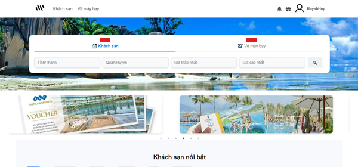

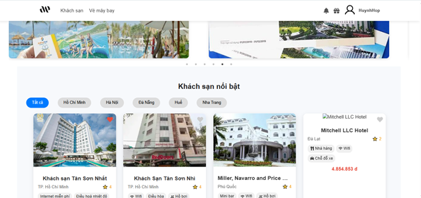

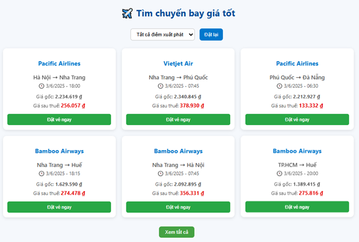

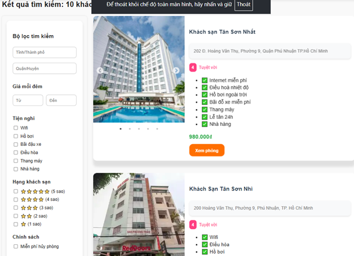

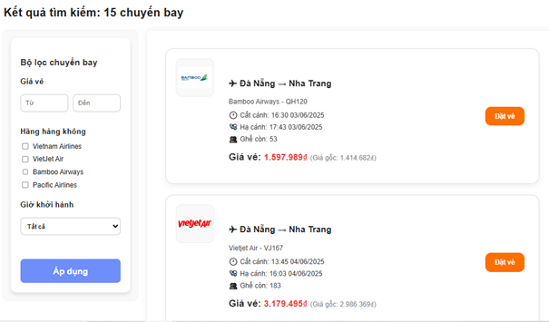

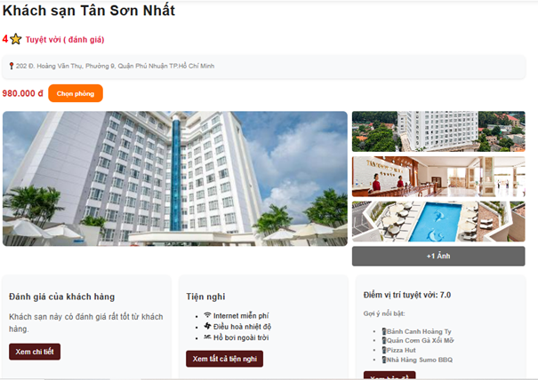

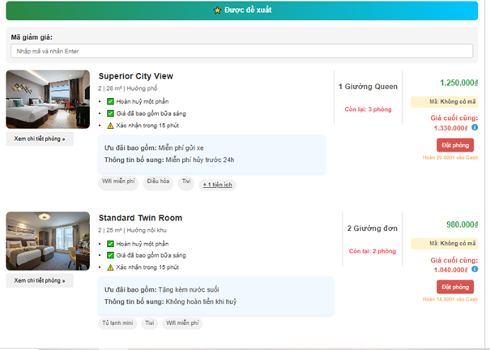

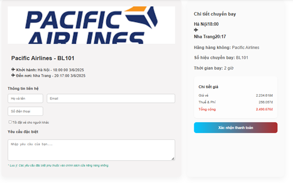

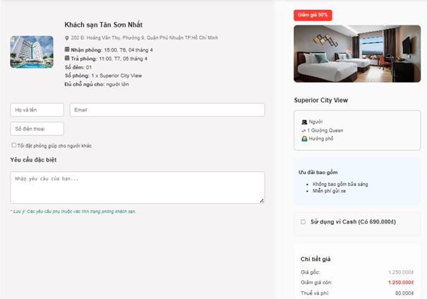

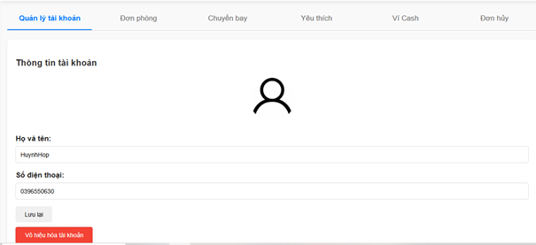

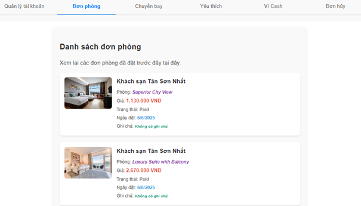

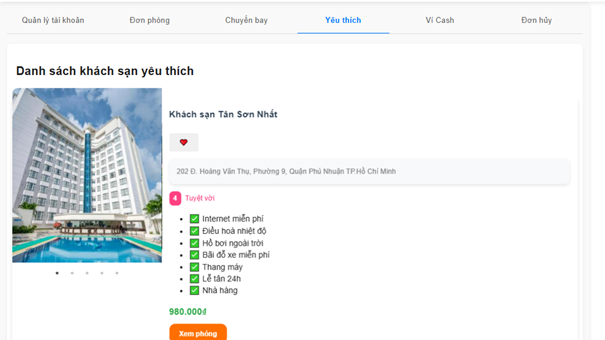

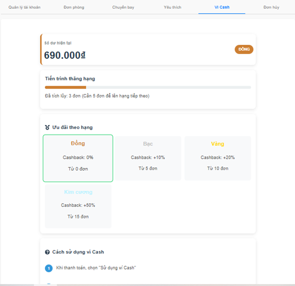

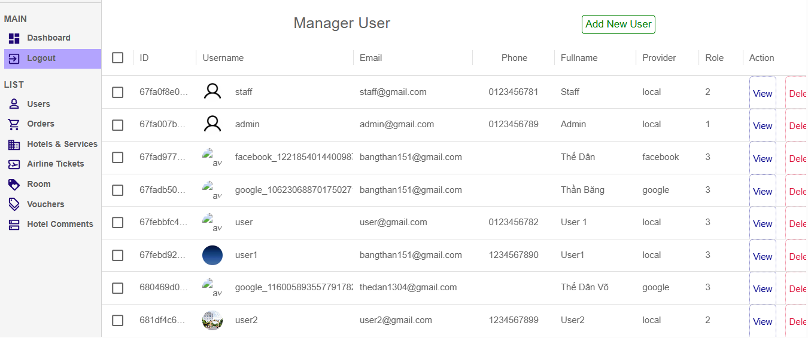

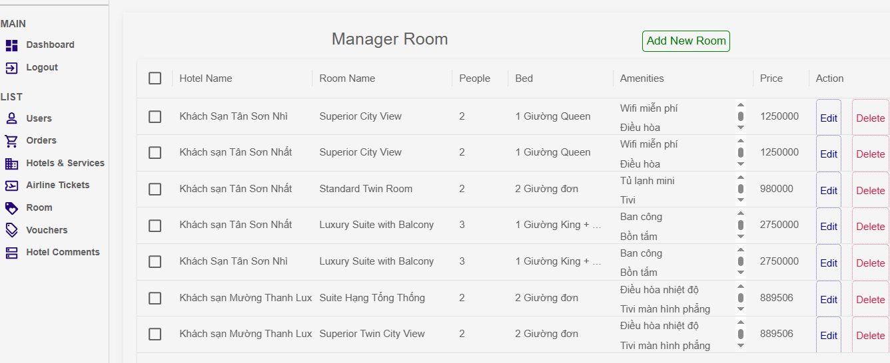

# ⚙️ Installation
- git clone https://github.com/HuynhHop/travel-booking-platform.git
- cd backend / cd frontend
- npm install
- npm start

# 👥 Team

- **Huynh Hop**
- **The Dan**
